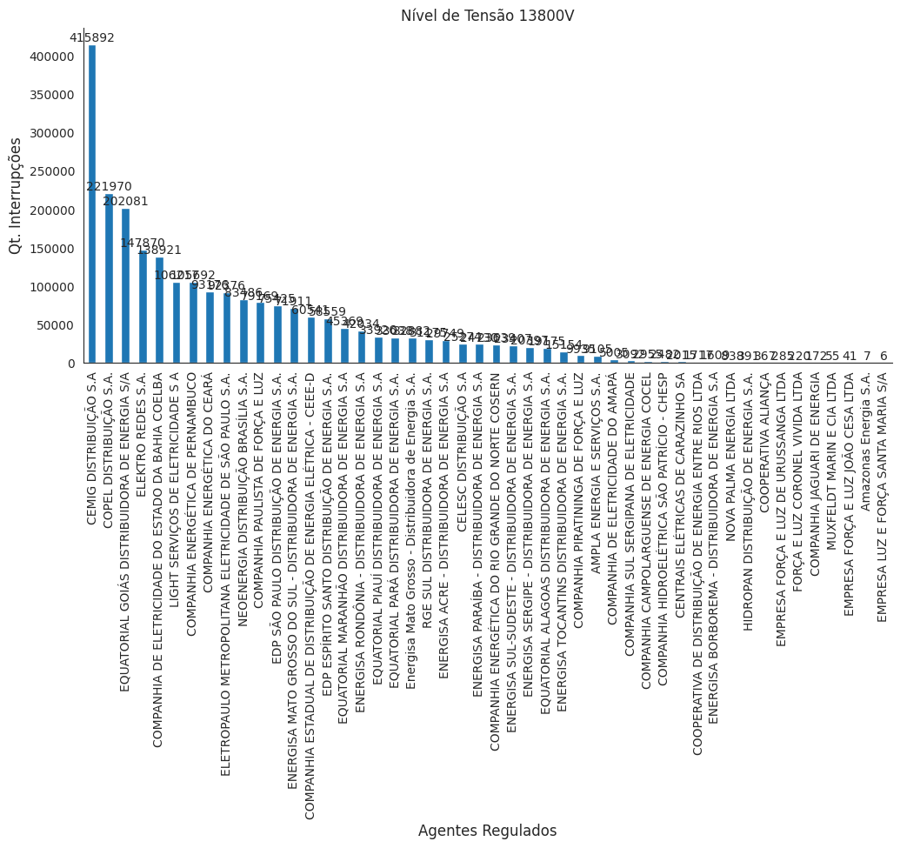

  

  <a href="#descrição">Descrição</a> •
  <a href="#objetivo">Objetivo</a> •
  <a href="#perguntas-chaves">Perguntas Chaves</a> •

  

---

<h1 align="center"> Interrupções de Energia Elétrica nas Redes de Distribuição no Brasil no Ano de 2023</h1>

## Descrição

Dados de todas as interrupções de energia elétrica ocorridas nas redes de distribuição de energia elétrica do país no ano de 2023. Não constam as interrupções ocorridas em áreas sob gestão de permissionárias de serviço público (cooperativas).

A base de dados é disponibilizada pela Agência Nacional de Energia Elétrica (ANEEL).

Pode ser obtida em [Link Base de Dados](https://dadosabertos.aneel.gov.br/dataset/interrupcoes-de-energia-eletrica-nas-redes-de-distribuicao)

## Objetivo

Analisar os Agentes Regulados com relação as interrupções, definindo quais são os melhores e piores fornecedores de energia e assistencia técnica;

## Perguntas Chaves

+ Qual o total de interrupções por estado e por Agente Regulado?

  

+ Quais Agente Relugado que mais tem interrupções?
  

  

+ Quais Agente Relugado que menos tem interrupções?

  

+ Quantidade de Interrupções por Nivel de Tensão por Agente Regulado?
  - Nível de Tensão 127v

  

  - Nível de Tensão 220V

  

  - Nível de Tensão 13,8kV

  

  - Nível de Tensão 69kV

  

